# 调整侧置 Kalart 测距仪的全新改进方法

**作者：** Jo Lommen

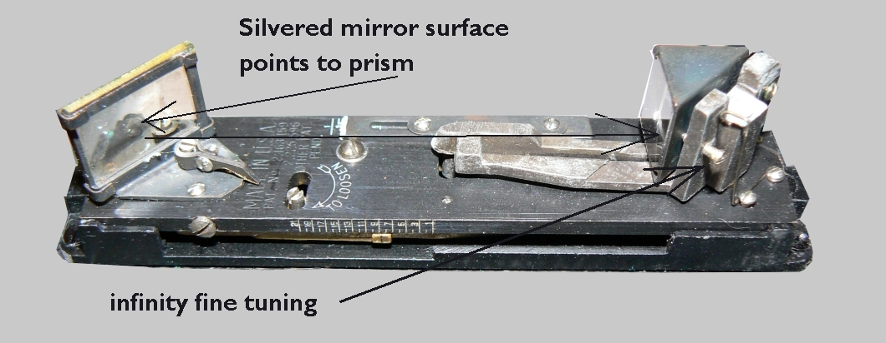

---

## 联系方式

在之前发布的说明中，我假设跟随导轨运动并因此跟随镜头的长臂或凸轮已正确连接到测距仪。但情况并非总是如此。

这个新的说明将向您展示整个测距机制的工作和调整，而不仅仅是将测距仪作为一个孤立的仪器进行校准。与导轨的正确连接对于良好的工作是必不可少的。

我希望通过这些说明，您的 Kalart 测距仪调整能够成功完成。

**请按步骤逐一执行这些说明**

---

## 步骤 I：首先找到镜头标准的无限远设置

*首先找到镜头标准的无限远设置。*

首先我们必须知道，调整只能针对您选择的**一个镜头**进行。  
每个不同焦距的镜头都需要单独调整。  
在 Speed Graphic 相机上，可以使用不同长度的镜头。从 127 mm 到 6 3/8 英寸。

**将相机放在三脚架上。**  
打开相机前门，转动标准的锁定装置并拉出标准，使其抵住无限远限位器。  
打开后盖，确保焦平面快门（如果安装了）处于"O"开启位置。

**将前快门设置为"T"位置。上弦快门并释放触发器。**  
前快门打开，您应该在毛玻璃上看到图像。

**对准远处的物体，如教堂塔尖，检查毛玻璃上的图像是否清晰。**  
只有当您对清晰的图像真正满意时，才可以跳过下一步。

**拧松无限远限位器并将其向前滑动几英寸到导轨上。**  
将相机对准远处的物体。拨动前标准锁定装置使其竖直。观察毛玻璃，前后移动前标准直到物体聚焦且图像非常清晰。

**向左或向右拨动锁定装置以锁紧标准，固定在此位置。**  
抬起铰链式的无限远限位器，将其向后滑动抵住标准，并用前侧的小螺丝固定。解锁标准，将其向后推，然后拧紧限位器的后部螺丝。将标准用力向前拉抵住限位器并锁定。再次检查毛玻璃上的图像，以确保限位器的位置没有改变。

为了确保标准锁定在正确的角度，请测量导轨末端到限位器的距离。两侧限位器的距离应相等。

---

## 步骤 II：Kalart 测距仪长凸轮的无限远设置及与导轨的同步

**取下实际镜头：** 松开标准上部的滑锁，将镜头安全放置。  
**旋出导轨：** 以便调整安装在导轨后部的偏心螺丝。  
**设置偏心螺丝：** 将偏心螺丝的凹槽置于垂直位置，以便日后进行左右修正。

 

**左图：** 显示了安装偏心螺丝支架的两个孔的位置。  
**右图：** 偏心螺丝安装到导轨位置的情况。

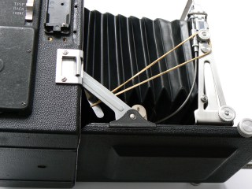 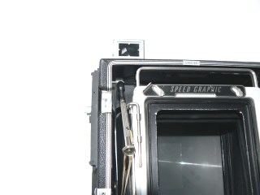

**左图：** 显示了长凸轮通过橡皮筋连接到前标准上进行临时调整的情况。长凸轮的前面是偏心螺丝。还展示了安装偏心螺丝支架的两个孔。  
**右图：** 显示了用于调节固定螺丝的螺丝刀（或六角扳手）。

### 内部机制调整详解：

**长凸轮与橡皮筋：**
- 有一个连接在 Kalart 测距仪轴上的臂或长凸轮，在调焦过程中跟随偏心螺丝移动。
- 这个臂通过固定螺丝连接到测距仪凸轮轴上。稍微拧松此螺丝，但要确保凸轮保持在轴上不掉落。
- 用橡皮筋的一端套在凸轮的下端，另一端套在框架夹紧旋钮上。

**移除测距仪外壳：**
- 将调焦旋钮完全转回相机体内（导轨收回）。
- 拧下外壳顶部的两个螺丝，取下 Kalart 测距仪外壳。
- 如果带有"测距仪环绕支架"，内部和机身还有额外的螺丝需要拆除。
- 如果安装了"Focuspot"（聚焦辅助灯），需小心耐心地拆除。
- 直接向上抬起 Kalart 外壳，使其与底板分离。此时可以看到"Kalart 主板"。

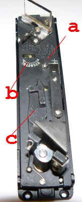

在主板中心有一个圆头螺丝（a）位于六角头调节螺丝（b）下方。"to loosen"表示松开方向。将相机左侧（手柄侧）放下，以免拧松螺丝时主板掉落。主板是自由的，可以取出，展示出黄铜凸轮轴组件。该凸轮与相机内主凸轮同步移动，进而控制棱镜的支点杆组件。黄铜凸轮在其转动过程中控制棱镜的支点杆组件。

**调整主板与黄铜凸轮：**

- **调整距离：** 将弹簧加载的黄铜凸轮用手指向左移动，直到左侧留出 **9 毫米** 的自由空间。
- **锁定：** 顺时针拧紧相机内长凸轮轴上的大臂固定螺丝。黄铜凸轮应保持在该位置。

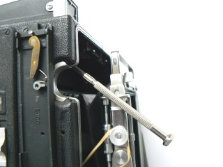 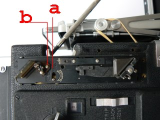

**验证与回装：**
- 将导轨向前转一圈，您会看到黄铜凸轮向右移动。停止此动作以松开橡皮筋。
- 确保当导轨完全缩回相机体内时，黄铜凸轮距离左侧 **9 毫米**。
- **极限状态：** 当凸轮旋出至最大值时，黄铜凸轮被迫抵住测距仪板的右侧。

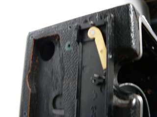 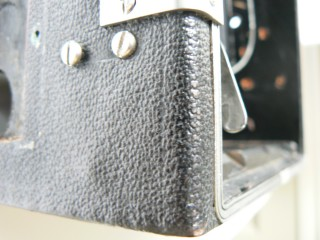

**重新组装主板：**
- 小心放回主板，同时将六角头调节螺丝向左按，使支点杆位于黄铜凸轮和底板边缘之间。
- **对齐关键点：**
  - 主板上的小孔必须落入底板的销钉上。
  - 主板下方的凹槽必须吻合底板的销钉。
- 转动调焦旋钮，观察棱镜组件是否移动。

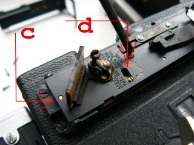 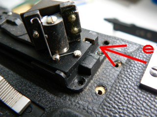

**清洁与检查：**
- **清洁镜片：** 清洁 Kalart 外壳的窗户。镀银镜子必须只用丝绸布清洁，请勿擦拭，因为镀层很容易脱落。
- **棱镜位置：** 棱镜组件背面和棱镜本身之间应保留最多 1-2 毫米的间隙。

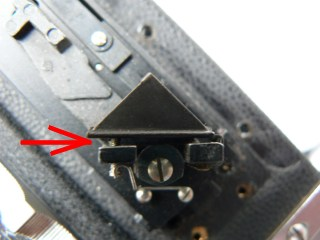 

**关键调整说明：**  
无穷远的调整是通过旋在相机导轨右侧滑轨后部的**偏心螺丝**完成的。
- **稍微向后旋：** 升高可移动图像。
- **向前旋：** 降低可移动图像。

### 反射镜系统说明

 

**如何找出分光镜哪一面是镀银面：** 将螺丝刀尖端放在表面。如果看不到螺丝刀和反射图像之间有空隙，那就是左侧的镀银面。右图中的玻璃上层是银层（下层是玻璃）。

---

## 步骤 III：更多调整

由于测距仪盖尚未安装，机制仍无保护，请小心操作。将相机放回三脚架并装回镜头。

**锁定位置：** 将前组用力拉向无穷远限位器并锁紧。将右侧调焦旋钮旁的导轨锁向右拨动锁定。

**校准调焦刻度：** 检查调焦刻度上的两个无穷远标记是否相对。如果不相对：
- 拧松导轨上距离刻度盘的两个螺丝 1-2 圈。
- 滑动刻度盘，使两个无穷远标记相对。
- 重新拧紧螺丝。

**关于焦距的注意事项：** 只有当相机床处于正确的调焦位置时，相机和镜头组合的调焦刻度才会正确对齐。对于焦距大于 90 mm 的镜头，这意味着不要处于"下沉床"位置。

**验证：** 通过无穷远处的毛玻璃清晰度来验证调焦刻度。如果两者一致，则可以使用该刻度进行所有距离的调焦。

---

## 步骤 IV：Kalart 测距仪的精细调谐

**警告与操作注意：**  
请注意：**顺时针**旋转螺丝 2（箭头方向）以松开。然后将指示器移动到下表中对应的刻度数字。重置刻度指示器后，**逆时针**旋转以拧紧！

**详细调整流程：**

1. **预调整：**
   - 检查导轨和前组是否仍处于无穷远位置，导轨是否完全旋回外壳内。
   - 根据镜头焦距，对后方的长刻度和前方的短刻度进行近似预调整。

2. **具体设置步骤：**
   - **设置后方刻度：** 松开螺丝 **2**（向右转四分之一圈），将指示器 **4** 移至所需设置，然后拧紧螺丝。
   - **设置前方刻度：** 松开两个螺丝 **1**，将指示器移至给定数字 **3**。

### 镜头与刻度对应表

| 胶片尺寸 | 镜头 | 长后刻度 | 短前刻度指示器 |
|:---------|:-----|:---------|:---------------|
| 4x5 英寸 | 127 mm ƒ 4,7 | 13 | 3 |
|          | 135 mm ƒ 4,5 | 15 | 3,5 |
|          | 165 mm ƒ 4,5 | 19 | 6 |
|          | 6 3/8 英寸 ƒ 2.9 | 17 | 6 |

3. **通过偏心螺丝进行无穷远设置：**
   - **环境：** 将相机置于没有后窗的昏暗房间。
   - **目标：** 寻找至少一英里外的明亮物体。
   - **操作：**
     - 透过分光镜或镀银镜观察，尝试找到双重图像。
     - 上下移动相机直到清楚地看到物体的两个图像。固定相机在该点。
     - 转动导轨后部的**偏心螺丝**。稍微向后旋以升高可移动图像，向前旋以降低可移动图像。
     - 再次转动调焦旋钮并检查更改。
     - 重复此过程直到图像重合。

---

## 步骤 V：精细调谐

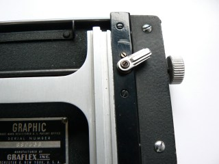 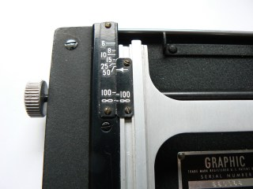

1. **近距测试：**
   - 根据上表设置调整刻度。
   - 将相机对准约 **25 英尺**外的平坦物体。
   - 使用放大镜确保毛玻璃上的图像绝对清晰。
   - 通过测距仪观察图像。如果图像重合，请在 **15 英尺**处重复测试。

2. **误差修正：**
   - 如果在这些距离下测距仪未对焦，需要在**后方刻度**上进行调整。
     - 当可移动图像**偏高**时，将指示器稍微**向下**移动。
     - 当可移动图像**偏低**时，将指示器稍微**向上**移动。

3. **循环验证：**
   - 调整后，重新检查测距仪在无穷远处的设置。
   - 如果无穷远设置发生偏移，请按照步骤 IV 中的说明（使用偏心螺丝）将其恢复对焦。
   - 再次检查 25 英尺和 15 英尺处的测距仪，如果不重合，重复上述说明直到达到重合。

---

## 结论

这种方法对于将测距仪调整到您特定镜头的精确焦距是必要的，而不是只能达到近似清晰聚焦的任意调整。

通过以上五个步骤的系统调整，可以显著提高 Kalart 测距仪的精度和可靠性。这种方法相比传统调整方式具有以下优势：

- **更高的精度**：系统性的调整方法确保各个环节都达到最佳状态
- **更好的稳定性**：全面的校准减少了环境因素的影响  
- **更强的可重复性**：标准化的流程便于维护和重新调整

建议在进行调整时严格按照步骤执行，并在每个阶段都进行充分的测试验证。

---

*本文翻译自 Jo Lommen 的技术文档，原文地址：https://jolommencam.com/kalart/new.html*